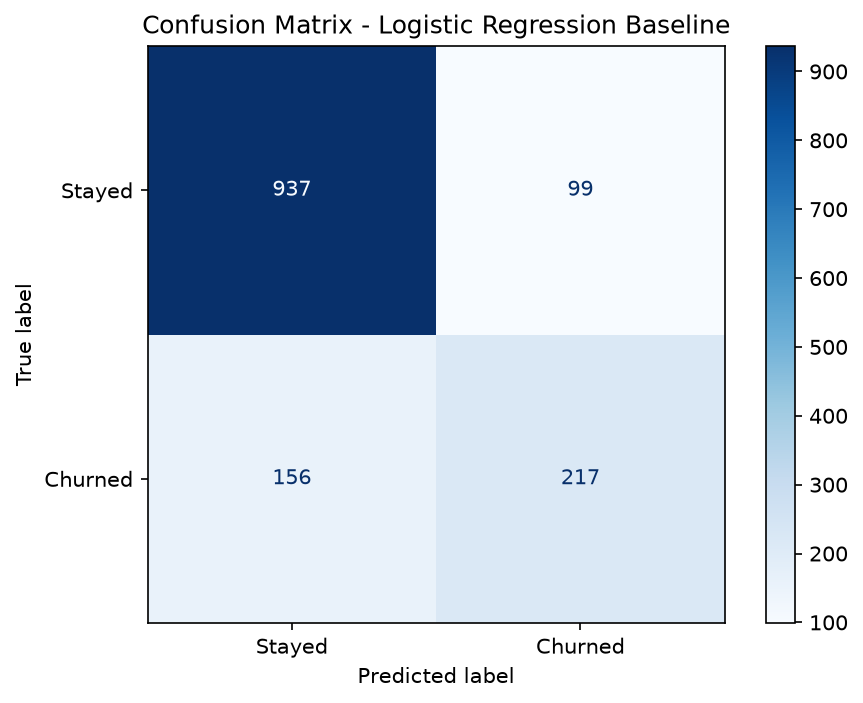

# Customer Churn Prediction

**Which telecom customers are about to cancel, and is it worth spending money to keep them?**

**Live demo:** https://customer-churn-predictor-telecom.streamlit.app

---

## 1. Business context

A telecom company loses about **27% of its customers**. Winning a replacement customer costs more than keeping an existing one, so the money is better spent on retention. But a retention team cannot phone 7,000 people, so they need a shortlist.

**Who would use this:** a customer retention or CRM team, and the marketing manager who owns the retention budget.

**The decision it supports:** *which customers do we spend a retention offer on this month, and which do we leave alone?*

**Why it matters:** every customer the team doesn't reach in time is a contract lost. Every customer they reach unnecessarily is a discount given to someone who was never going to leave. This project is about finding a sensible balance between those two mistakes, and being explicit that it is a trade-off rather than a free win.

This is a portfolio project built on a public dataset. There is no real client, and the 70% recall target described below is one I set myself at the start, not a brief from a stakeholder.

---

## 2. Data and method

### The data

[Telco Customer Churn](https://www.kaggle.com/datasets/blastchar/telco-customer-churn) from Kaggle — **7,043 customers, 21 columns**, one row per customer: demographics, the services they subscribe to, contract and payment details, and whether they churned.

One real data-quality problem: `TotalCharges` was stored as text and hid 11 blank values. All 11 belong to customers with `tenure = 0` who hadn't been billed yet, so I set them to `0` before converting the column to a number.

### The approach

1. Explored and cleaned the raw data, saving one clean dataset everything downstream reuses.
2. Plotted churn against contract type, tenure, monthly charges and payment method *before* modelling, so I'd know what a sensible result looked like.
3. Dropped `customerID` (no signal) and `TotalCharges` (collinear with tenure × monthly charges), label-encoded the binary columns and one-hot encoded the rest with `drop_first=True`.
4. Split 80/20 (5,634 train / 1,409 test), with the same `random_state=42` split reused in every notebook so results are comparable.
5. Built a logistic regression baseline, then tested random forest and XGBoost, then SMOTE, then a lower decision threshold.

The cleaning and encoding logic lives in [`src/data_preprocessing.py`](src/data_preprocessing.py) as unit-tested functions rather than notebook cells. Notebooks 02 and 04 import and call them, and so does the Streamlit app — so the same transformations run everywhere.

### Results

| Model | Recall (churn) | F1 | Accuracy |
|---|---|---|---|
| Logistic Regression (baseline) | 0.58 | 0.63 | 82% |
| Random Forest | 0.47 | 0.54 | 79% |
| Random Forest + SMOTE | 0.61 | 0.59 | 77% |
| XGBoost | 0.53 | 0.57 | 79% |
| XGBoost + SMOTE | 0.61 | 0.58 | 77% |
| **XGBoost + SMOTE + threshold 0.3** | **0.77** | **0.60** | **73%** |

### Why XGBoost — and where that reasoning runs out

I want to be straight about this, because the table above doesn't say what a churn project usually says.

**At the default 0.5 threshold, neither tree model beat the logistic regression baseline on recall.** Plain random forest (0.47) and plain XGBoost (0.53) were both worse than logistic regression (0.58). After SMOTE, random forest and XGBoost landed at **exactly the same recall (0.61)**, and random forest had the slightly better F1.

The two changes that actually moved the number were **SMOTE and lowering the decision threshold to 0.3**. Both are model-agnostic. They would work with any classifier that outputs probabilities.

I kept XGBoost for the final model because it tied for the best post-SMOTE recall and because gradient boosting picks up interactions between contract, tenure and service mix without me hand-specifying them. But **this project does not demonstrate that XGBoost was necessary.** I never ran logistic regression with the same SMOTE and 0.3 threshold. It might have got close, and it would have been more interpretable. That is the first experiment I'd run next. If logistic regression matched it, I'd switch, because it is easier for a retention manager to read.

---

## 3. Key findings

### Finding 1 — Accuracy was hiding a bad model

**Observation.** The logistic regression baseline scored **82% accuracy** but caught only **217 of 373 churners (58%)**.

**Insight.** 73% of customers in this dataset don't churn. A model that predicts "nobody ever churns" scores 73% accuracy while being completely useless. So 82% is only nine points better than doing nothing at all — and the headline number gives no hint of that.

**Implication.** If I had reported "82% accurate" to the retention manager, they would have signed off on a model that misses **4 in every 10** of the customers who actually leave.

**Recommendation.** Report **recall on the churn class** as the headline metric for this problem, and show the confusion matrix alongside it. Accuracy should not appear in a stakeholder summary for an imbalanced problem.



---

### Finding 2 — The algorithm wasn't the bottleneck; the imbalance and the threshold were

**Observation.** Swapping logistic regression for random forest made recall **worse** (0.58 → 0.47). XGBoost was also worse (0.53). SMOTE lifted both tree models to 0.61. Lowering the decision threshold from 0.5 to 0.3 lifted it to **0.77**.

**Insight.** Of the 0.24 recall gained between plain XGBoost (0.53) and the final model (0.77), two-thirds came from the threshold change alone: a single number, no retraining. Reaching for a more powerful algorithm first was the wrong instinct, because the models were being trained on data where 73% of examples said "stayed", so they learned to say "stayed".

**Implication.** Effort spent on model selection here would have been largely wasted. The 0.5 threshold is a default, not a business decision, and it was costing the retention team most of their churners.

**Recommendation.** On an imbalanced problem, fix the class balance and set the decision threshold deliberately **before** comparing algorithms. Treat the threshold as a business lever the retention manager owns, not a modelling detail.


---

### Finding 3 — Whether this model is worth running depends on two numbers I don't have

**Observation.** On the 1,409-customer test set, the final model flags **576 customers**. Of those, **287 really do churn** and **289 don't**. It **misses 86** churners. The baseline flagged only 316 customers: 217 real churners and 99 false alarms.

**Insight.** Moving from the baseline to the final model buys **70 extra churners caught**, and costs **190 extra retention offers sent to people who were staying anyway**. That is the trade.

Writing **L** for the value lost when a churner leaves undetected and **C** for the cost of one retention offer:

| Comparison | The final model is the better choice when |
|---|---|
| vs. contacting nobody | a lost customer is worth more than **2.0 ×** a retention offer |
| vs. the logistic baseline | a lost customer is worth more than **2.7 ×** a retention offer |
| vs. contacting every customer | a lost customer is worth less than **9.7 ×** a retention offer |

**Implication.** This model has an operating band rather than a universal case. If a lost contract is worth less than about two retention offers, the cheapest thing the business can do is nothing. If a lost contract is worth more than about ten retention offers, the cheapest thing is to blanket-contact all 7,043 customers and skip the model entirely. The model only earns its place in between — which, for most telecoms, is where the real numbers sit, but I have not verified that for any actual company.

**Recommendation.** Ask finance for the average contribution margin of a lost contract, and marketing for the fully-loaded cost of one retention offer. Then set the threshold from those two numbers instead of from my 70% recall target. I picked 0.3 because it was where recall crossed 70%. That is an arbitrary anchor, and the economically correct threshold is almost certainly not 0.3.

---

### Finding 4 — The model's top features are not the story the EDA told

**Observation.** In the EDA, **contract type** gave the cleanest separation between churners and stayers, and churn was heavily concentrated in the **first few months of tenure**. But the model's feature importances rank **electronic-check payment (0.22)** first, **having no internet service (0.16)** second, and **two-year contract (0.09)** third — and neither `tenure` nor `MonthlyCharges` appears in the top 10 at all.

**Insight.** Part of this is an encoding artefact. `drop_first=True` splits contract across **two** dummy columns (`Contract_One year` and `Contract_Two year`, with month-to-month as the dropped reference), so its signal is divided while payment method keeps a single column. **I don't have a confident explanation for the absence of tenure**, and I would rather say so than invent one.

**Implication.** This chart cannot be handed to a stakeholder as "the causes of churn". XGBoost's gain-based importance measures **how much the model uses a feature**, not **which direction it pushes the prediction**, and certainly not causation. Nothing here says that paying by electronic check *makes* someone leave; it may simply be how customers who were already at risk happen to pay.

**Recommendation.** Use the **EDA** (contract type, tenure) for the story you tell the retention team, and use the **model** only for scoring individual customers. Before making any causal claim, re-check with permutation importance or SHAP values, which handle correlated one-hot columns better.


<details>
<summary>Remaining charts</summary>

- `outputs/figures/churn_by_monthly_charges.png`
- `outputs/figures/churn_by_payment_method.png`
- `outputs/figures/correlation_heatmap.png`

</details>

---

## 4. Business impact — what I'd actually recommend

**Do these three things:**

1. **Get the two cost numbers before deploying anything.** Contribution margin of a lost contract, and fully-loaded cost of a retention offer. Until those exist, the 0.3 threshold is a guess, and the model might be outside its useful operating band entirely. This is the highest-value next step and it needs no modelling work.

2. **Run the model as a ranked shortlist, not an automatic action.** At the 0.3 threshold it flags 41% of customers, so on a 7,000-customer base that is roughly 2,900 people. Note the model scores who *looks* like a churner today, not *when* they will leave, so it cannot tell you who is leaving this month. Give the retention team the list ranked by predicted probability and let them work down it as far as budget allows. That way the threshold matters less, because the ranking does the work.

3. **Act on the EDA findings in parallel, because they don't need a model at all.** Month-to-month customers churn far more than contract customers, and churn concentrates in the first months. Incentives to move onto annual contracts, and better first-90-days onboarding, are worth doing whether or not the model ever ships.

**Set expectations honestly with the stakeholder:** about **half of everyone this model flags was never going to leave**. That is not a defect to be fixed. It is the price of catching 77% of the ones who were. If the retention team expects a clean list of certain leavers, they'll lose faith in the model by month two.

---

## 5. Limitations

**What this project doesn't cover**

- **One static snapshot.** There is no time dimension, so no seasonality, no sequence of events before a customer leaves, and no way to know *when* someone will churn — only whether they look like a churner today.
- **No real cost data**, which is why Finding 3 is a ratio rather than a pounds-and-pence figure.
- **Lightly tuned.** `n_estimators=100` and otherwise default hyperparameters. No grid search, no Bayesian optimisation.
- **Single train/test split, no cross-validation.** Every score here comes from one 20% test set of 1,409 customers. With 373 churners in it, a recall of 0.77 has a margin of error of roughly ±4 percentage points, so small differences between the models in that table are probably noise.
- **No SQL.** The whole pipeline is pandas on CSVs.

**Model-specific risks**

- **SMOTE fabricates the training data.** It creates synthetic churners by interpolating between real ones, so the model is partly fitted to customers who don't exist. It also assumes the space between two churners is itself churner-like, which is shaky for one-hot columns — an interpolated value of 0.4 for "has fibre optic" is not a real customer. I applied it to the training set only, so the test scores are still measured against real people, but the fitted model carries this in.
- **Overfitting risk.** SMOTE plus a boosted model on a 5,634-row training set is a combination that can memorise. XGBoost does apply L2 regularisation by default (`reg_lambda=1`), but I left it at the default rather than tuning it, and I did not add early stopping. I never compared training and test scores directly, so I can't quantify the gap — that check is missing and I'd add it first.
- **It will decay.** The model learns today's pricing, product mix and competitors. New tariffs, a competitor's promotion or a change to the billing system would all shift the relationships it depends on. `PaymentMethod_Electronic check` being the top feature is a particular worry: if the company changes how it takes payment, the model's strongest signal becomes meaningless overnight. It would need monitoring for drift and retraining on a schedule.
- **Possible unfair bias.** The feature set includes `gender`, `SeniorCitizen`, `Partner` and `Dependents`. Age and sex are protected characteristics under the Equality Act 2010, and `Dependents` ranks in the model's top 10 features. A model that directs retention discounts away from, say, older customers would be a problem both commercially and legally. I have not tested for this. Before any deployment I'd check whether flag rates differ across those groups, and seriously consider dropping the demographic features altogether, since the contract and billing features carry most of the signal anyway.
- **The app scores customers one at a time by re-encoding the full dataset.** `prepare_customer_for_prediction()` appends the customer to all 7,043 cleaned rows so the one-hot encoding sees every category. It is correct, but it would not scale to batch scoring. A persisted encoder would be the production answer.

---

## 6. Tech stack

| Tool | Used for |
|---|---|
| Python 3.11+ | Core language |
| pandas | Loading, cleaning and reshaping the data |
| Matplotlib / Seaborn | EDA and result charts |
| scikit-learn | Train/test split, logistic regression, random forest, metrics |
| XGBoost | The final classifier |
| imbalanced-learn (SMOTE) | Balancing the training set |
| joblib | Saving and reloading the trained model |
| Jupyter Notebook | The eight analysis notebooks |
| pytest | Unit tests for the preprocessing module |
| Streamlit | The interactive demo app |

---

## 7. How to run it

```bash
git clone https://github.com/layaung-linnlett/customer_churn_prediction.git
cd customer_churn_prediction

python -m venv .venv
source .venv/bin/activate          # macOS/Linux
# .venv\Scripts\activate           # Windows

pip install -r requirements.txt
```

Run the notebooks in order — each depends on the file the previous one wrote. Notebook 02 produces the cleaned data, 04 the model-ready matrix, 08 the saved model.

```bash
jupyter notebook          # then run 01 -> 08
```

```bash
python -m pytest          # unit tests for the preprocessing module
```

```bash
streamlit run app.py      # the demo app
```

The trained model loads on its own if you'd rather not re-run everything:

```python
import joblib
model = joblib.load("outputs/models/final_model.pkl")
# Flag a churner when probability >= 0.3 (the tuned threshold)
churn_flags = (model.predict_proba(X)[:, 1] >= 0.3).astype(int)
```

**The Streamlit app** ([`app.py`](app.py)) takes one customer's details and returns a live risk score from the trained model, using the same tested preprocessing functions as the notebooks.


### Project structure

```
customer_churn_prediction/
├── app.py                               # Interactive Streamlit demo app
├── data/
│   ├── raw/
│   │   └── telco-customer-churn.csv     # Original dataset — never modified
│   └── processed/
│       ├── telco_churn_clean.csv        # Cleaned data (output of notebook 02)
│       └── model_ready.csv              # Encoded model matrix (output of notebook 04)
├── notebooks/
│   ├── 01_data_exploration.ipynb        # Shape, data types, hidden missing values, class imbalance
│   ├── 02_data_cleaning.ipynb           # Fix TotalCharges, handle blanks, save clean data
│   ├── 03_eda.ipynb                     # Churn patterns by contract, charges, tenure, payment
│   ├── 04_feature_engineering.ipynb     # Drop redundant columns, encode categoricals
│   ├── 05_model_building.ipynb          # Logistic regression baseline
│   ├── 06_model_evaluation.ipynb        # Confusion matrix, precision/recall/F1, why recall matters
│   ├── 07_model_improvement.ipynb       # Random forest, XGBoost, SMOTE, threshold tuning
│   └── 08_final_model.ipynb             # Final model, feature importance, save & verify
├── outputs/
│   ├── figures/                         # All charts saved by the notebooks
│   └── models/
│       └── final_model.pkl              # Trained final model
├── src/
│   ├── __init__.py
│   └── data_preprocessing.py            # Reusable, tested cleaning & encoding functions
├── tests/
│   └── test_data_preprocessing.py       # Unit tests for the preprocessing module
├── pytest.ini
├── requirements.txt
├── .gitignore
├── LICENSE
└── README.md
```

---

## Contact

**La Yaung Linn Lett**
- GitHub: [github.com/layaung-linnlett](https://github.com/layaung-linnlett)
- LinkedIn: [linkedin.com/in/layaung-linnlett](https://www.linkedin.com/in/layaung-linnlett/)
- Email: layaunglinnlett1@gmail.com

*Dataset: [Telco Customer Churn — Kaggle](https://www.kaggle.com/datasets/blastchar/telco-customer-churn) (7,043 customers, 21 features).*
