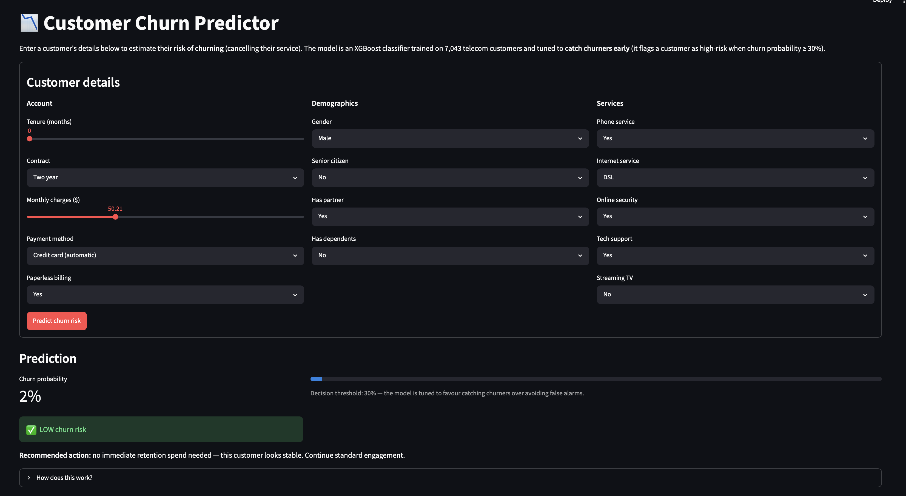
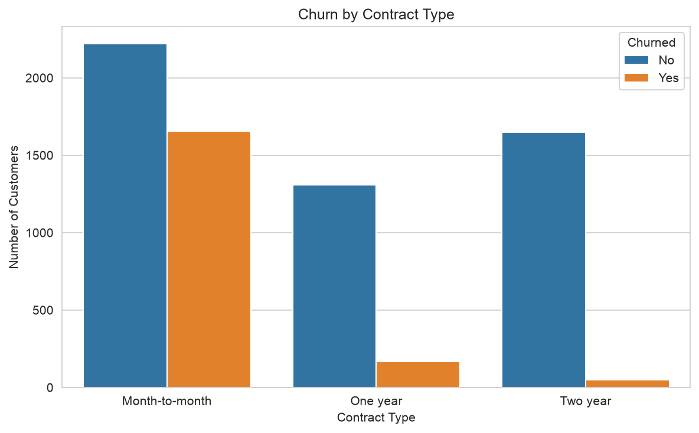
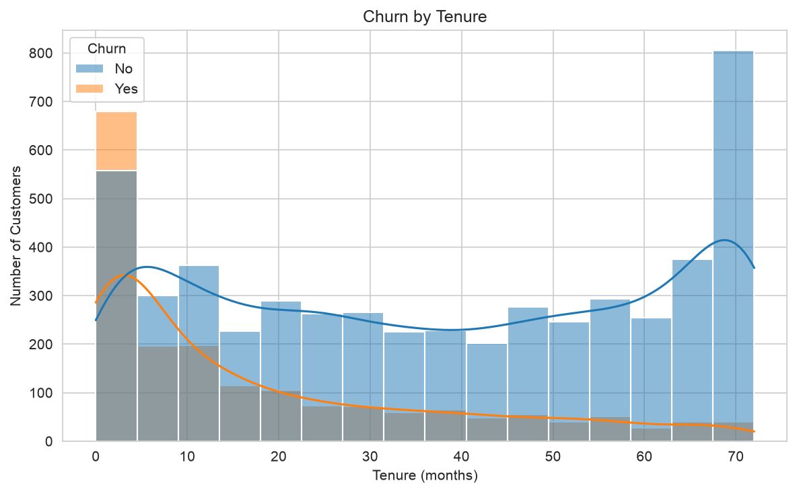
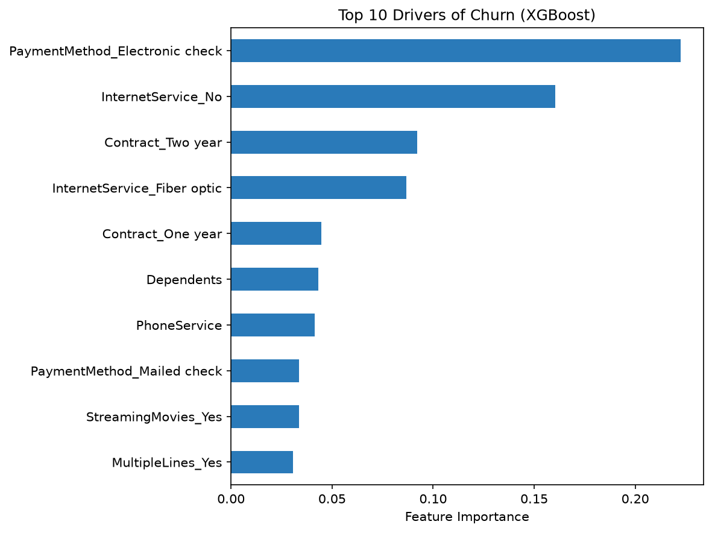
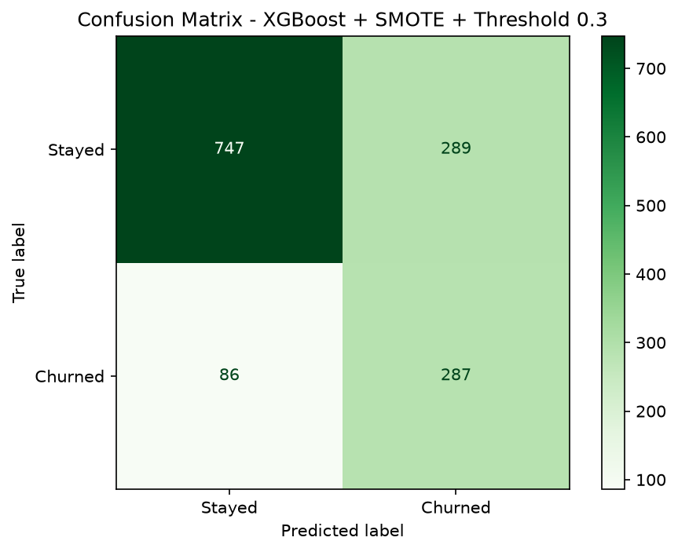

# Customer Churn Prediction

**A machine-learning pipeline that flags the telecom customers most likely to cancel — catching 75% of real churners so the business can act before they leave.**

---

## Overview

Telecom companies lose a large share of revenue to **churn** — customers cancelling their service. Because winning a new customer costs far more than keeping an existing one, even a small reduction in churn has an outsized impact on profit.

This project answers a single business question: **which customers are about to leave, while there's still time to keep them?**

Using a real dataset of 7,043 customers, it works through the full data-science lifecycle — exploration, cleaning, EDA, feature engineering, modelling, evaluation, and tuning — to produce a model that prioritises **catching churners** over raw accuracy. The final model identifies **75% of customers who actually churn**, giving the retention team a focused, high-risk shortlist to target instead of contacting everyone.

---

## Key Findings

- **~27% of all customers churn** — a major, costly retention problem.
- **Contract type is the single biggest driver:** month-to-month customers churn far more than those on one- or two-year contracts.
- **The first few months are the danger zone:** churn is heavily concentrated among low-tenure (new) customers.
- **High monthly charges (~$70–$110)** and **electronic-check payments** are both strongly linked to churn.
- A standard model looked good on paper — **82% accuracy** — but caught only **58% of churners**. Accuracy hid the real weakness.
- The final tuned model lifts churn detection (**recall**) from **58% → 75%**, catching roughly **3 in 4** customers who actually leave and clearing the business target of 70%.

> **Why not just maximise accuracy?** On an imbalanced dataset, a model that predicts "nobody churns" scores 73% accuracy while being useless. This project optimises **recall** instead, because a *missed churner* (lost revenue) costs far more than a *false alarm* (an unnecessary retention offer).

---

## Interactive Demo

An interactive **Streamlit app** ([`app.py`](app.py)) lets you enter a customer's
details and get a live churn-risk prediction from the trained model — reusing the
same tested preprocessing pipeline.

```bash
streamlit run app.py
```

> _Tip: deploy it free on [Streamlit Community Cloud](https://streamlit.io/cloud) and add the live link here, plus a screenshot/GIF below._

<!--  -->

---

## Tech Stack

| Tool | Used for |
|---|---|
| **Python 3.13** | Core language |
| **pandas / NumPy** | Data loading, cleaning, and manipulation |
| **Matplotlib / Seaborn** | Exploratory and result visualisations |
| **scikit-learn** | Train/test split, Logistic Regression, Random Forest, evaluation metrics |
| **XGBoost** | Final gradient-boosted classifier |
| **imbalanced-learn (SMOTE)** | Correcting the class imbalance |
| **joblib** | Saving and loading the trained model |
| **Jupyter Notebook** | Analysis and storytelling |
| **pytest** | Unit-testing the preprocessing module |
| **Streamlit** | Interactive churn-prediction demo app |

---

## Project Structure

```
customer-churn/
├── app.py                               # Interactive Streamlit demo app
├── data/
│   ├── raw/
│   │   └── telco-customer-churn.csv     # Original dataset — never modified
│   └── processed/
│       ├── telco_churn_clean.csv        # Cleaned data (output of notebook 02)
│       └── model_ready.csv              # Encoded model matrix (output of notebook 04)
├── notebooks/
│   ├── 01_data_exploration.ipynb        # Shape, data types, hidden missing values, class imbalance
│   ├── 02_data_cleaning.ipynb           # Fix TotalCharges, handle blanks, save clean data
│   ├── 03_eda.ipynb                     # Visual churn patterns by contract, charges, tenure, payment
│   ├── 04_feature_engineering.ipynb     # Drop redundant columns, encode categoricals
│   ├── 05_model_building.ipynb          # Logistic Regression baseline
│   ├── 06_model_evaluation.ipynb        # Confusion matrix, precision/recall/F1, why recall matters
│   ├── 07_model_improvement.ipynb       # Random Forest, XGBoost, SMOTE, threshold tuning
│   └── 08_final_model.ipynb             # Final model, feature importance, save & verify
├── outputs/
│   ├── figures/                         # All charts saved by the notebooks
│   └── models/
│       └── final_model.pkl              # Trained, ready-to-reuse final model
├── src/
│   ├── __init__.py
│   └── data_preprocessing.py            # Reusable, tested cleaning & encoding functions
├── tests/
│   └── test_data_preprocessing.py       # Unit tests for the preprocessing module
├── pytest.ini                           # Test configuration
├── requirements.txt                     # Pinned dependencies
├── .gitignore
├── LICENSE
└── README.md
```

---

## How To Run

```bash
# 1. Clone the repository
git clone https://github.com/layaung-linnlett/customer_churn_prediction.git
cd customer_churn_prediction

# 2. (Recommended) create and activate a virtual environment
python -m venv .venv
# Windows
.venv\Scripts\activate
# macOS / Linux
source .venv/bin/activate

# 3. Install dependencies
pip install -r requirements.txt

# 4. (Optional) run the unit tests for the preprocessing module
python -m pytest

# 5. Launch Jupyter and run the notebooks in order (01 → 08)
jupyter notebook

# 6. Or launch the interactive demo app
streamlit run app.py
```

Run the notebooks **in numerical order** — each one builds on the data produced by the previous step. Notebook 02 creates the cleaned data, notebook 04 creates the model-ready matrix, and notebook 08 saves the final model to `outputs/models/`.

The trained model can also be loaded directly without re-running everything:

```python
import joblib
model = joblib.load("outputs/models/final_model.pkl")
# Predict a churner when probability >= 0.3 (the tuned threshold)
churn_flags = (model.predict_proba(X)[:, 1] >= 0.3).astype(int)
```

---

## Methodology

1. **Data Exploration** — Inspected shape (7,043 × 21), data types, and class balance. Uncovered that `TotalCharges` was stored as text and hid 11 blank values.
2. **Data Cleaning** — Converted `TotalCharges` to numeric and filled the 11 blanks with `0` (they belong to brand-new, `tenure = 0` customers). Saved a single clean dataset reused everywhere downstream.
3. **EDA** — Visualised churn against contract type, monthly charges, payment method, and tenure to build business intuition before modelling.
4. **Feature Engineering** — Dropped `customerID` (no signal) and `TotalCharges` (collinear with tenure × charges); label-encoded binary columns and one-hot-encoded multi-category columns.
5. **Baseline Model** — Logistic Regression as a simple, interpretable yardstick (recall 0.58).
6. **Model Improvement** — Compared Random Forest and XGBoost, applied **SMOTE** to balance the training data, and **lowered the decision threshold to 0.3** to prioritise recall.
7. **Final Model** — XGBoost + SMOTE + 0.3 threshold, saved with `joblib` and verified by reloading.

**Why these choices?** Logistic Regression sets an honest baseline; tree-based models capture non-linear interactions; SMOTE addresses the root cause (imbalance) rather than the symptom; and threshold tuning aligns the model with the real business cost of a missed churner.

> **Engineering note:** the cleaning and feature-engineering logic lives in [`src/data_preprocessing.py`](src/data_preprocessing.py) as reusable, documented functions, covered by a `pytest` suite in [`tests/`](tests/). Notebooks 02 and 04 import and call these functions, so the exact same validated transformations run everywhere — no copy-pasted logic.

### Results

| Model | Recall (churn) | F1 | Accuracy |
|---|---|---|---|
| Logistic Regression (baseline) | 0.58 | 0.63 | 82% |
| Random Forest | 0.47 | 0.54 | 79% |
| Random Forest + SMOTE | 0.60 | 0.58 | 77% |
| XGBoost | 0.52 | 0.57 | 79% |
| XGBoost + SMOTE | 0.62 | 0.60 | 78% |
| **XGBoost + SMOTE + Threshold 0.3** | **0.75** | **0.59** | **72%** |

The final model deliberately trades some accuracy and precision for a large gain in recall — a conscious business decision to minimise missed churners.

---

## Visualisations

All figures are generated by the notebooks and saved to `outputs/figures/`.

**Churn by contract type — the strongest driver**


**Churn by tenure — risk is concentrated in the first months**


**Top drivers of churn (final XGBoost model)**


**Final model confusion matrix — far fewer missed churners**


<details>
<summary>More charts</summary>

- `outputs/figures/churn_by_monthly_charges.png`
- `outputs/figures/churn_by_payment_method.png`
- `outputs/figures/correlation_heatmap.png`
- `outputs/figures/confusion_matrix_baseline.png`

</details>

---

## Limitations & Future Work

**Limitations**
- The dataset is a **static snapshot** — it captures no seasonality or change in customer behaviour over time.
- **SMOTE** creates synthetic minority examples that may not perfectly mirror real churners.
- Hyperparameters were only lightly tuned (no full grid or Bayesian search).
- Higher recall comes at the cost of **lower precision** — some retention budget will be spent on customers who would have stayed anyway.

**Future work**
- Systematic hyperparameter tuning (GridSearchCV / Optuna) and cross-validation for more robust estimates.
- Richer engineered features (tenure buckets, services-per-customer, charge ratios).
- Calibrate predicted probabilities and choose the threshold against **real campaign costs** rather than a fixed 0.3.
- Deploy as an API and monitor for data/concept drift in production.

---

## Contact

**La Yaung Linn Lett**
- GitHub: [github.com/layaung-linnlett](https://github.com/layaung-linnlett)
- LinkedIn: [linkedin.com/in/layaung-linnlett](https://www.linkedin.com/in/layaung-linnlett/)
- Email: layaunglinnlett1@gmail.com

---

*Dataset: [Telco Customer Churn — Kaggle](https://www.kaggle.com/datasets/blastchar/telco-customer-churn) (7,043 customers, 21 features).*
